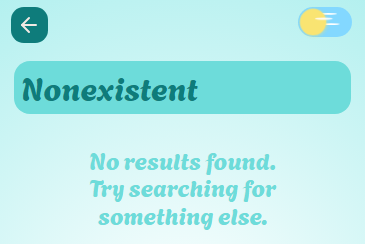
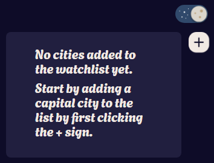

# Bene:studio coding challenge

This repo has been created as part of an interview process to fulfill the following requirements:

```
// Page 1
// Selected cities are stored in Redux
// Clicking on the "+" sign opens Page 2
// Clicking on a city name opens Page 3

// Page 2
// The page has only 1 autocomplete field
// You can serach capitals by name
// Figure out how to feed the autocomplete field
// Highlight the result (max 8 items)
// capitals already added to the list should be hidden in the search field
// Selected one can be saved with SAVE button and redirects to page 1
// Top left arrow redirect to page 1
// Save button is only visible when city is selected

// Page 3
// Selected city name, 24h format running clock
// using openweathermap API
// using weather icons
// show temperature, sunset, sunrise times
// back arrow to Page 1
```

## Extra bits

<style>
.small {
  height: 5rem;
  border-radius: 1rem;
}

img {
  border-radius: 0.5rem;
  margin: 1rem;
  max-width: 23rem;
}
</style>






## Quick Setup

To run the app locally after cloning:

```
npm i
```

```
npm run dev
```

To run a few tests:

```
npm run test
```

## Tech stack related notes

Alongside **React and Typescript** which are my usual preferred choices for web applications, I decided to try **Vite** as the module bundler, since it is apparently a popular choice nowadays.

Since the requirements specified using **Redux**, I opted to try one of the relatively recent [redux templates](https://github.com/reduxjs/redux-templates) as a starting point for the app.

## Not using a library for the search box

Given a similar task in a real situation I would probably have used a react library for the autocomplete search box, but I thought that would partly defeat the purpose of this coding task, since that is one of the more complex aspects of this app.
